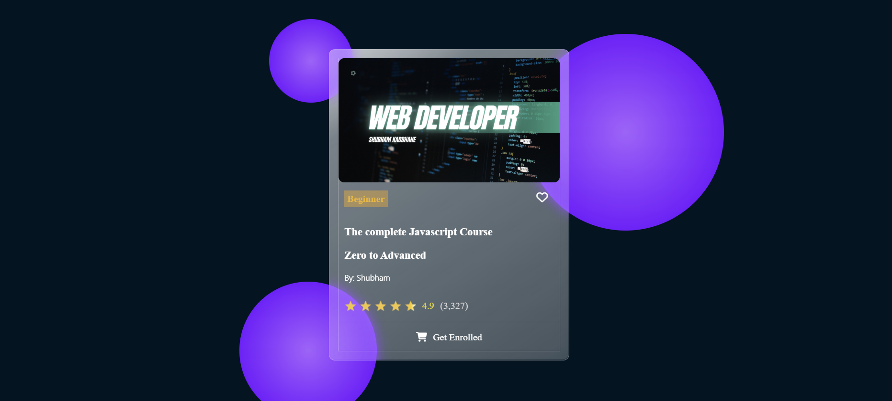

# 🎨 Glass Card UI — Figma Practice Project

## 📘 Overview

This project showcases a **Glass Card UI** that I designed in **Figma** during my initial learning phase. The purpose was to get comfortable with the Figma interface, learn to use design tools efficiently, and explore **modern UI trends** like **Glassmorphism**.

---

## 💡 Objective

To familiarize myself with:

* Basic and advanced **Figma tools** (frames, auto-layout, constraints)
* Creating **aesthetic modern UIs** using blur, transparency, and gradients
* Understanding **visual hierarchy**, spacing, and alignment
* Building reusable **components and design systems**

---

## 🧱 Design Features

**Highlights of the Glass Card design:**

* Semi-transparent card with a frosted glass effect (Glassmorphism)
* Smooth drop shadows and rounded corners for soft depth
* Minimal typography with balanced color contrast
* Gradient overlays for enhanced visual appeal
* Clean layout with aligned icons and text

---

## 🖼️ Preview

</img>

---

## 🛠️ Tools Used

* **Figma** — for UI design and prototyping
* **Google Fonts** — for typography
* **Material Icons** — for consistent iconography

---

## 🚀 Learnings

Through this project, I learned:

* How to apply **blur, opacity, and transparency layers** effectively
* Organize and structure **frames and naming conventions**
* Use **auto-layout** for responsiveness
* Maintain color consistency using a **design palette system**

---

## 📎 Credits

Designed by **Shubham Kadbhane**
 Aspiring UI/UX Enthusiast
📍 Pune, India

---

### 🏁 Summary

This Glass Card UI marks the beginning of my **UI/UX design journey**. It helped me get hands-on experience with Figma, learn modern interface design principles, and set the foundation for more complex and interactive projects in the future.
